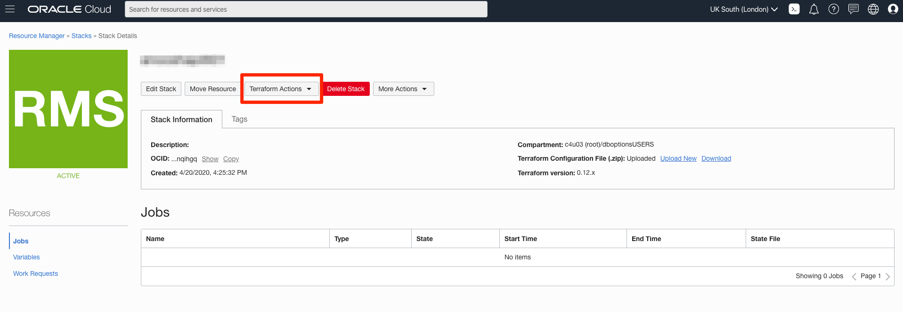
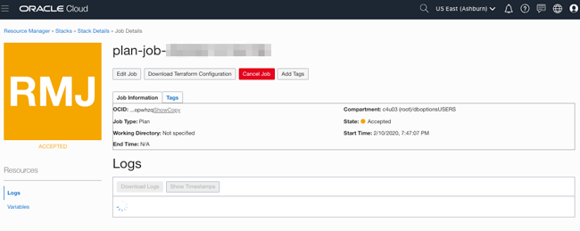
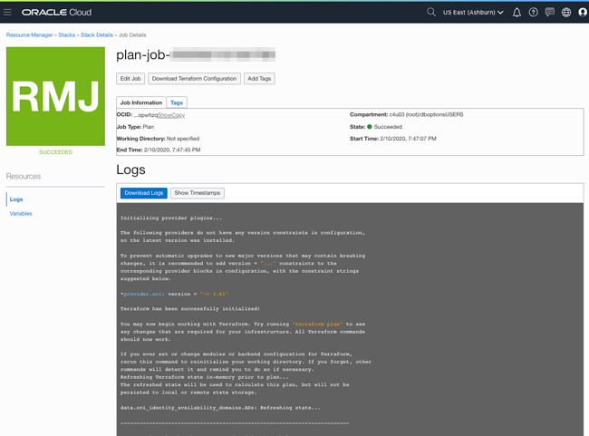
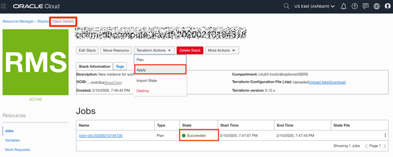
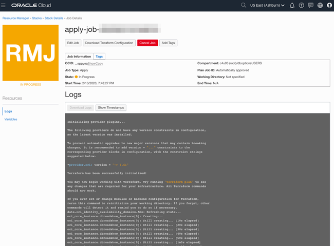
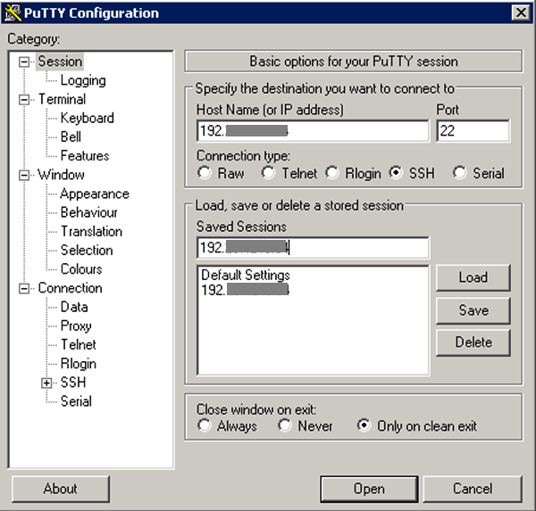
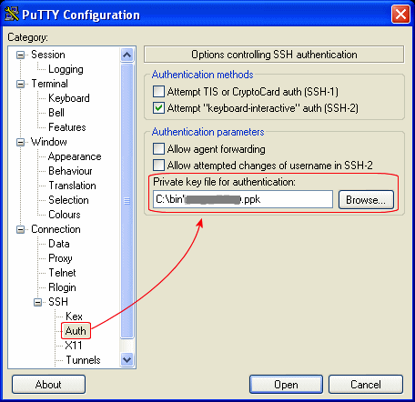

# Setup - Primary and Standby Database 19c

## Introduction

In this lab you will show setup a Oracle Cloud network (VCN) and the compute instance with a pre-configured Oracle Database 19c using Oracle Resource Manager and Terraform. You can setup the primary and standby database using the related scripts. The primary and the standby database are in different VCN. You can setup primary and standby database in the same region or in different region.

Estimated Lab Time: 60 minutes.

### Objectives

-   Use Terraform and Resource Manager to setup the primary and standby environment.

### Prerequisites

This lab assumes you have already completed the following:
- An Oracle Free Tier, Always Free, Paid or LiveLabs Cloud Account
- Create a SSH Keys pair

Click on the link below to download the Resource Manager zip files you need to build your enviornment.

- [db19c-primary-num.zip](https://github.com/minqiaowang/on-premise-adg/raw/master/setup-compute/db19c-primary-num.zip) - Packaged terraform primary database instance creation script
- [db19c-standby-num.zip](https://github.com/minqiaowang/on-premise-adg/raw/master/setup-compute/db19c-standby-num.zip) - Packaged terraform standby database instance creation script


## **Step 1:** Prepare the Primary Database

1. Login to the Oracle Cloud Console, open the hamburger menu in the left hand corner. Choose **Resource Manager > Stacks**. Choose the **Compartment** that you want to use, click the  **Create Stack** button. *Note: If you are in a workshop, double check your region to ensure you are on the assigned region.*

    

    

    

    

2. Click the **Browse** link and select the primary database setup zip file (`db19c-primary-num.zip`) that you downloaded. Click **Select** to upload the zip file.

    

    Enter the following information. Accept all the defaults and click **Next**.

    - **Name**:  Enter your name of the stack. *(Do not enter any special characters here, including periods, underscores, exclamation etc, it will mess up the configuration and you will get an error during the apply process.)*

    - **Description**:  Same as above

    - **Compartment**:  Accept the default or change to the correct compartment.

3. Enter the following information and click **Next**. 

    

    **SSH Public Key**:  Paste the public key you created in the earlier step. *(Note: If you used the Oracle Cloud Shell to create your key, make sure you paste the pub file in a notepad, remove any hard returns.  The file should be one line or you will not be able to login to your compute instance)*

4. Click **Create**.

    

5. Your stack has now been created!  Now to create your environment. *Note: If you get an error about an invalid DNS label, go back to your Display Name, please do not enter ANY special characters or spaces. It will fail.*

    

## **Step 2:** Terraform Plan (OPTIONAL)

When using Resource Manager to deploy an environment, execute a terraform **Plan** to verify the configuration. This is an optional step in this lab.

1.  [OPTIONAL] Click **Terraform Actions** -> **Plan** to validate your configuration. Click **Plan**. This takes about a minute, please be patient.

    

    

    

    

## **Step 3:** Terraform Apply

When using Resource Manager to deploy an environment, execute a terraform **Plan** and **Apply**. Let's do that now.

1.  At the top of your page, click on **Stack Details**.  Click the button, **Terraform Actions** -> **Apply**. Click **Apply**. This will create your instance and install Oracle 19c. This takes about a minute, please be patient.

    

    

    

    

2.  Once this job succeeds, you will get an apply complete notification from Terraform.  Examine it closely, 1 resource has been added. Congratulations, your environment is created! Time to login to your instance to finish the configuration.

    

## **Step 4:** Connect to your Instance

### MAC or Windows CYGWIN Emulator

1.  Go to **Compute** -> **Instances** and select the instance you created (make sure you choose the correct compartment).

2.  On the instance homepage, find the Public IP addresss for your instance.

3.  Open up a terminal (MAC) or cygwin emulator as the opc user.  Enter yes when prompted.

    ````
    ssh -i ~/.ssh/optionskey opc@<Your Compute Instance Public IP Address>
    ````

    

    

4.  After successfully logging in, proceed to Step 5.

### Windows using Putty

1.  Open up putty and create a new connection.

    ````
    ssh -i ~/.ssh/optionskey opc@<Your Compute Instance Public IP Address>
    ````

    

2.  Enter a name for the session and click **Save**.

    

3.  Click **Connection** > **Data** in the left navigation pane and set the Auto-login username to root.

4.  Click **Connection** > **SSH** > **Auth** in the left navigation pane and configure the SSH private key to use by clicking Browse under Private key file for authentication.

5.  Navigate to the location where you saved your SSH private key file, select the file, and click Open.  NOTE:  You cannot connect while on VPN or in the Oracle office on clear-corporate (choose clear-internet).

    

6.  The file path for the SSH private key file now displays in the Private key file for authentication field.

7.  Click Session in the left navigation pane, then click Save in the Load, save or delete a stored session Step.

8.  Click Open to begin your session with the instance.

## **Step 5:** Verify the Database is Up

1.  From your connected session of choice **tail** the `buildsingle.log`, This file has the configures log of the database.

    ````
    <copy>
    tail -f /u01/ocidb/buildsingle.log
    </copy>
    ````
    

2.  When you see the following message, the database setup is complete - **Completed successfully in XXXX seconds** (this may take up to 30 minutes). You can do the **Step 6** to setup the standby environment while waiting the primary database ready .

    

3.  Run the following command to verify the database with the SID **ORCL** is up and running.

    ````
    <copy>
    ps -ef | grep ORCL
    </copy>
    ````

    

4. Verify the listener is running:

    ````
    <copy>
    ps -ef | grep tns
    </copy>
    ````

    

5.  Connect to the Database using SQL*Plus as the **oracle** user.

    ````
    <copy>
    sudo su - oracle
    sqlplus system/Ora_DB4U@localhost:1521/orclpdb
    exit
    </copy>
    ````

    

6.  To leave `sqlplus` you need to use the exit command. Copy and paste the text below into your terminal to exit sqlplus.

    ````
    <copy>
    exit
    </copy>
    ````

7.  Copy and paste the below command to exit from oracle user and become an **opc** user.

    ````
    <copy>
    exit
    </copy>
    ````

You now have a fully functional Oracle Database 19c instance **ORCL** running on Oracle Cloud Compute, the default pdb name is **orclpdb**. This instance is your primary DB.

## Step 6: Prepare the standby database

Repeat from the Step 1 to Step 5 to prepare the standby database. This time please choose the `db19c-standby-num.zip` file in the Resource Manager. And you can choose another region and compartment for the standby database.

After complete, you have a standby database that SID is **ORCL**, same as the primary database and the `DB_UNIQUE_NAME` is **ORCLSTBY**, the default pdb name is also named **orclpdb**.

You may proceed to the next lab.

## Acknowledgements
* **Author** - Minqiao Wang, DB Product Management, Oct 2020
* **Contributors** -  
* **Last Updated By/Date** - Minqiao Wang, DB Product Management, Oct 2020

## See an issue?
Please submit feedback using this [form](https://apexapps.oracle.com/pls/apex/f?p=133:1:::::P1_FEEDBACK:1). Please include the *workshop name*, *lab* and *step* in your request.  If you don't see the workshop name listed, please enter it manually. If you would like us to follow up with you, enter your email in the *Feedback Comments* section.

